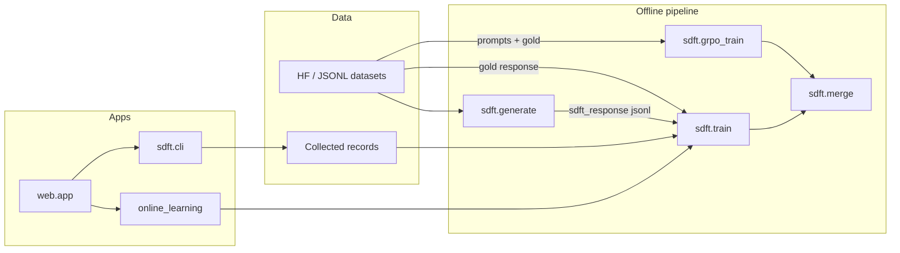

# Architecture

Local-SDFT is a small, Apple-Silicon-friendly toolkit for **Self-Distillation
Fine-Tuning** (SDFT) on Liquid AI's LFM2.5-230M / LFM2.5-1.2B-Thinking, plus
comparable baselines (gold SFT, GRPO) and a live online-learning demo.



## Package map

| Path | Role |
|---|---|
| `sdft/generate.py` | Teacher pass: rewrite targets in-distribution |
| `sdft/train.py` | LoRA SFT on `sdft_response` or gold `response` (`--target`) |
| `sdft/grpo_train.py` | LoRA GRPO baseline via TRL `GRPOTrainer` |
| `sdft/merge.py` | Fold adapter into base weights |
| `sdft/config.py` | YAML → dataclasses (single source of knobs) |
| `sdft/rewards.py` | Local reward fns for GRPO (`instruction`, `boxed`, `bfcl`) |
| `sdft/alpacaeval_ablation.py` | AE2 prompt strategies (ZS / FS / CoT) for `/perf` (Colab inlines its own) |
| `sdft/alpacaeval_score.py` | AE2 score dispatch (`JUDGE=local|openai`) → win-rate / LC |
| `sdft/alpacaeval_local_judge.py` | Local open HF pairwise judge ≈ AE2 protocol (not GPT-4-Turbo LC) |
| `sdft/peft_utils.py` | Shared `adapter_ready` / chat model loading |
| `sdft/online_learning/` | Per-turn tone feedback → tiny SDFT → reply |
| `sdft/toolcall/` | ReTool-style tool loop + OpenClaw eval |
| `sdft/bfcl/` | Local BFCL-v3 AST/irrelevance eval + train-data helpers |
| `sdft/records/` | Shared collect + benchmark persistence |
| `web/` | FastAPI + HTMX UI (`/`, `/data`, `/perf`) |
| `configs/compare/` | Batch-size-1 baselines (Alpaca + BFCL; 230M + 1.2B) |
| `scripts/run_batch1_comparison.py` | Train + score base / SFT / SDFT / GRPO (Alpaca) |
| `scripts/run_alpaca_eval.py` | Local or official AlpacaEval-style judge on model_outputs JSON |
| `scripts/run_bfcl_baselines.py` | Train + score BFCL gold / SDFT / GRPO |
| `scripts/run_bfcl_eval.py` | BFCL local subset wrapper |
| `scripts/build_bfcl_train_data.py` | BFCL gold/GRPO jsonl + split manifest |

## Entry points

```bash
# Offline SDFT
uv run python -m sdft.generate --config configs/default.yaml
uv run python -m sdft.train    --config configs/default.yaml
uv run python -m sdft.merge    --config configs/default.yaml

# Web demo
uv run python -m web.app   # http://127.0.0.1:8765

# BFCL local AST (showcase; flags match README tables)
uv run python scripts/run_bfcl_baselines.py \
  --suite 230m --num-train-per-cat 64 --num-eval-per-cat 32 --max-grpo-steps 256 \
  --out outputs/compare/bfcl_comparison_full.json
uv run python scripts/run_bfcl_baselines.py \
  --suite 1_2b --num-train-per-cat 64 --num-eval-per-cat 32 --max-grpo-steps 256 \
  --out outputs/compare/bfcl_1_2b_comparison_full.json
uv run python scripts/run_bfcl_eval.py --suite 230m --num-examples 32

# Batch-size-1 Alpaca heuristic (secondary)
uv run python scripts/run_batch1_comparison.py --num-train 32 --num-eval 16 --max-grpo-steps 16

# Colab AE2-style win-rate (standalone notebook, no repo clone):
#   notebooks/local_sdft_colab.ipynb
#   hard-coded Qwen/Qwen3.5-9B 4-bit pairwise judge ≈ AE2 protocol (not LC)
#   (CLI cousin still uses the package; supports JUDGE=local|openai:)
#   uv sync --extra alpacaeval && \
#     uv run python scripts/run_alpaca_eval.py --model-outputs ... --name sdft
```

## Batch-size-1 philosophy

The online-learning demo updates LoRA with `batch_size: 1` / `grad_accum: 1`
after every chat turn. The `configs/compare/batch1_*.yaml` suite uses the same
update style offline so SFT, SDFT, and GRPO are comparable to that demo:

- **SFT / SDFT:** `per_device_train_batch_size=1`
- **GRPO:** TRL requires `batch_size % num_generations == 0`; we use
  `batch_size=2`, `num_generations=2` (smallest group that still is GRPO)

## Web modules

| Module | Responsibility |
|---|---|
| `web/app.py` | FastAPI routes + uvicorn entry |
| `web/chat_context.py` | History / instruction UI assembly |
| `web/perf_runtime.py` | Chat inference + SSE streaming |
| `web/perf_models.py` | Model / adapter selection for `/perf` |
| `web/transcript_parse.py` | Tool-call transcript rendering |
